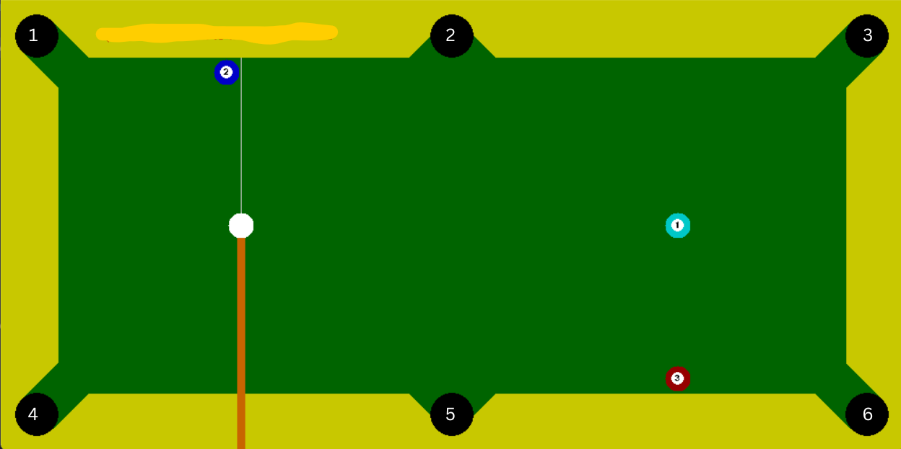
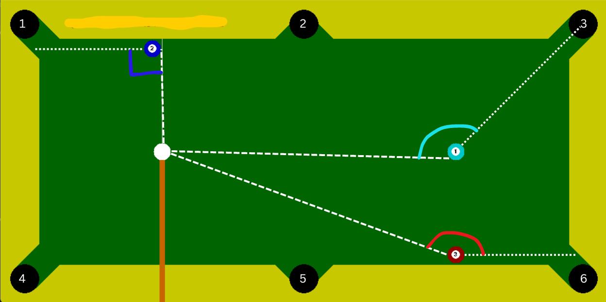
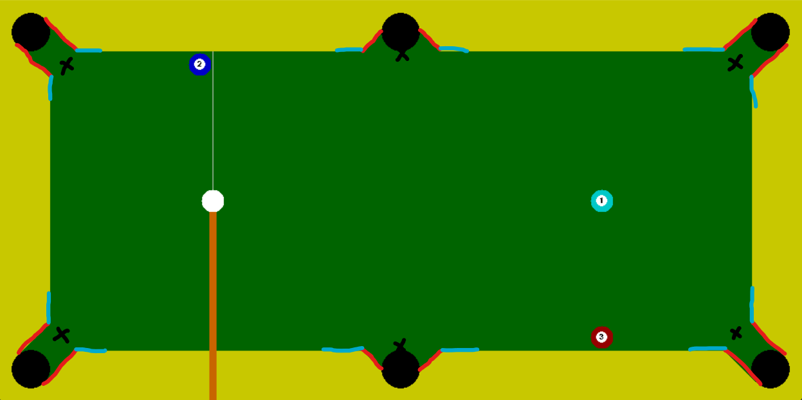

# Programming Assignment 3
(TA : Harsh Shah and Shrey Modi)  
This repository contains code for PA3 of CS747 - Foundations of Learning Agents (Autumn 2023). Clone/download this repository and read instructions over [here](https://www.cse.iitb.ac.in/~shivaram/teaching/cs747-a2023/index.html).

(simulator taken from [here](https://github.com/max-kov/pool))  

#######################################################################################

By: Archit Swamy

In this assignment, we attempt to build an RL agent that learns how to optimally play pool. 
Disclaimer: The simulations consist entirely of solid balls (only for now, hopefully), and no spin can be applied to the cue ball.

## Preliminaries

An agent performs actions as (v, theta), where v is the speed of the cue ball, and theta is the angle at which the cue ball is shot.
First we ask the question, what makes a good pool-playing agent? Consider the situation below: 

Let us initially ignore complicated actions such as rebounds, and potting a solid ball off of a solid ball or "chaining" balls. 
Which solid ball should the cue ball try to pot? Given a solid ball, which hole should the agent try to pot it in? A solid first instinct (hehe) might be to first pot ball 3 in hole 6. Then we ask, what makes ball 3 so much more of an attractive shot that balls 1 and 2? Consider the image below, depicting possible trajectories for the balls:

It is easily observed that the angle made by the pair of lines cue to ball 3, and ball 3 to hole, is the greatest of any other angle made by the cue-solid-hole pairs. We can reason that such a positioning makes for a better shot because the shot is **"straighter"** than any other. Also, note that if the angle between the cue-solid-hole lines is lesser than or equal to 90 degrees, then the shot cannot be made.

In order to pot a solid in a hole, it will also be necessary that there is no other ball between the solid and the hole.

In this pool simulator, a normal noise is added to the angle at which the cue ball is shot based on the speed it is being shot at. Therefore, faster and thus longer shots are bound to be less accurate. The agent should also be able to optimise the speed at which the cue ball is shot in order to maximise accuracy.

Finally, it is important to take into consideration the geometry of the pool table. As can be seen as marked red in the image below, there are "corridors" approaching each hole. 

It is important to realise when potting a ball, if one aims directly for the hole, then the walls highlighted in blue above may interfere. Thus whenever the agent takes a shot, it does not aim for the hole. Rather, it aims for the entrance of the corridors as indicated by the black crosses.  

## A Preliminary Approach

We require here that given a state, the agent decides which ball to hit into which hole. Once this has been decided, some excessively simple geometry will tell us exactly what direction to hit the cue ball in. The speed with which to hit it is matter we will visit later.

### Defining a Feature Vector
Using the above, we define a feature vector of size 7 by 6 by 3. Each solid ball (7 such balls) is defined by 3 features with respect to each of the 6 holes, namely,
* The straightness of the shot
* The distance between the cue ball and the solid ball
* A boolean which is true if there a ball between the solid ball and the respective hole, and is false otherwise
If the ball is not on the table, let each of the 18 (3x6) features identically be 0. 

### Discretising the State Space
Our states are defined entirely by the positions of the cue and solid balls. Our state provides us with our feature vector. However, our state space is continuous and therefore infinite. In order to treat this as an MDP that must be learnt, we must discretise the state space. 
* The straightness can take on values between -180 to 180 degrees. Each 1 degree sector will be treated as a distinct state.
* The distance can be broken into a distinct number of states based on the maximum possible distance. This discretisation will affect the accuracy of the shots. 

## Offline Learning

The simulator allows us to generate traces i.e, a description of the states and actions in a given episode.

## Online Learning

